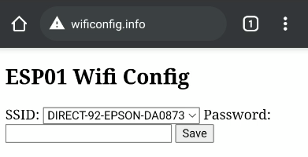

# ESP8266 Wifi Configuration Server

Configure WiFi credentials in an easy way, instead of hardcode it in code.

### Used Library

* [ESPAsyncWebServer](https://github.com/me-no-dev/ESPAsyncWebServer)
    * Requires [ESPAsyncTCP](https://github.com/me-no-dev/ESPAsyncTCP)
* [DNSServer](https://github.com/esp8266/Arduino/tree/master/libraries/DNSServer)

### Usage

Connect to the ESP AP WiFi (default SSID is `ESP8266`). Access `wificonfig.info`. Presented with the page bellow.

Select SSID from list (scanned by the ESP) and input the password and click save. It will return the SSID if successful.

The ESP AP will desapear and will try to connect to configured WiFi. If the conection timesout (30 seconds), the ESP AP will be reset and you can do the process again.

After it connects the creds are save in the flash and will be accessable on reboot.